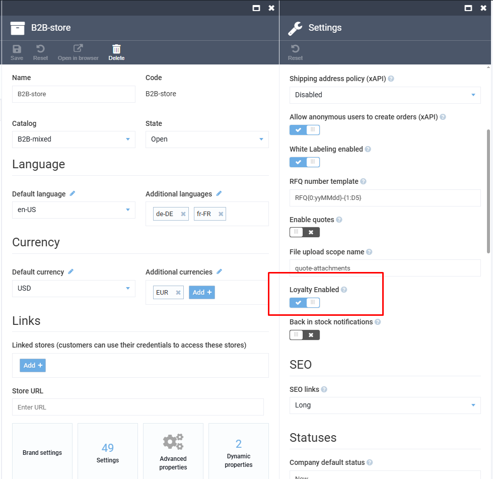
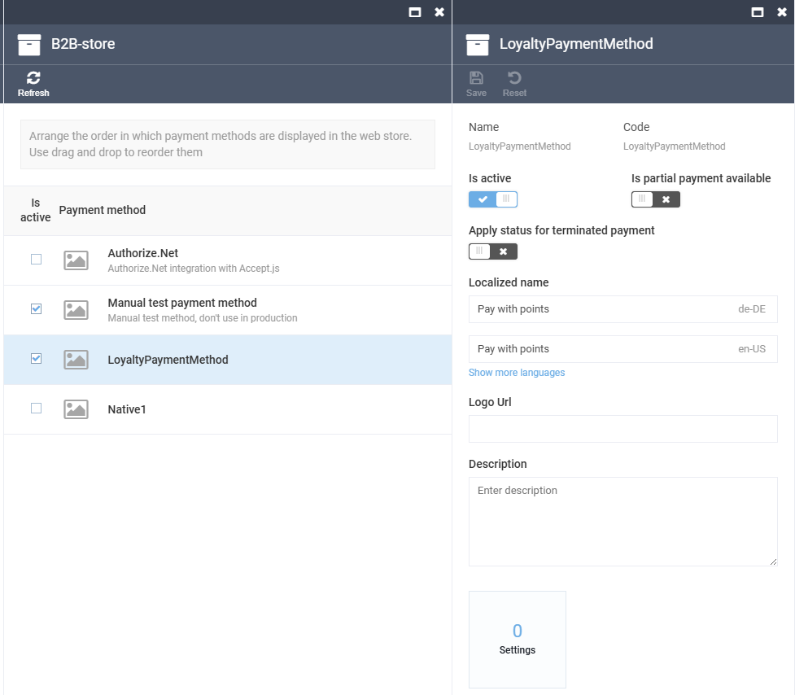
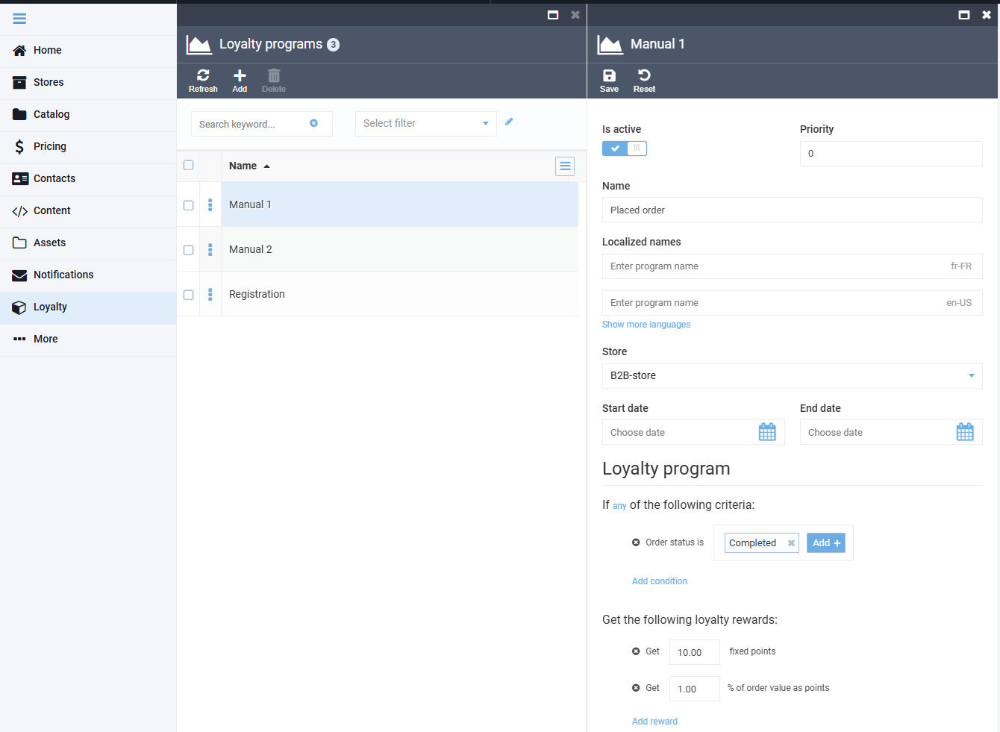
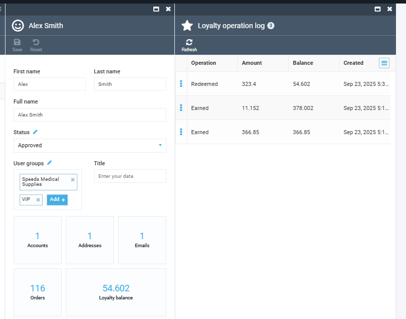
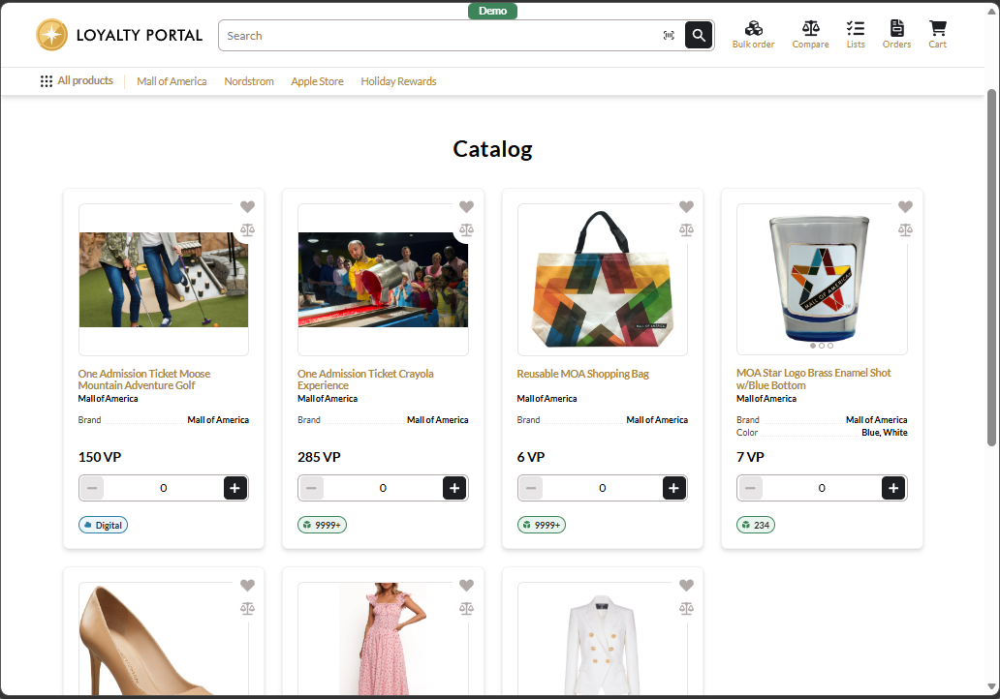
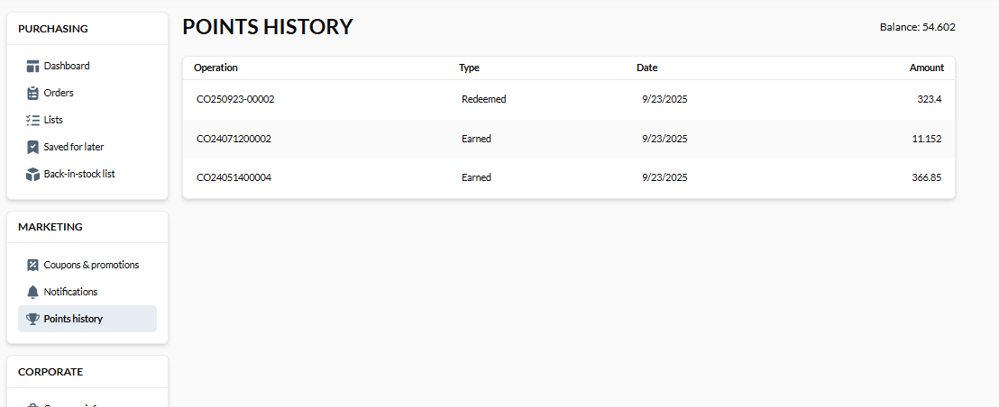

# Loyalty

## Overview

The **VirtoCommerce.Loyalty** module provides a flexible loyalty program management system for the [VirtoCommerce](https://virtocommerce.org) e-commerce platform. It enables store managers to define loyalty programs, reward customers with points, track transactions, and allow customers to pay for their orders using loyalty points.

## Key Features

- **Loyalty Program Management**
  - Create and configure loyalty programs with specific conditions and reward rules.
  - Define rewards in fixed points or as a percentage of the order value.
  - Set program priorities, activation periods, and localized names.

- **Transaction Logging**
  - Full audit log of loyalty points accruals and redemptions.
  - Visibility into customer activity and balance changes.

- **Loyalty Payments**
  - Includes a built-in **LoyaltyPaymentMethod** allowing customers to pay for orders using loyalty points.
  - Payment with points can be activated and displayed as a checkout option on the storefront.
  - Currently, points can only be used if the customer’s balance fully covers the order amount.
  - Conversion rate: **1 point = 1 unit of order currency**.

## Configuration

### 1. Enable Loyalty in Store Settings
1. Navigate to **Store → Settings**.  
2. Toggle **Loyalty Enabled**.

### 2. Activate Loyalty Payment Method
1. Navigate to **Store → Payment Methods**.  
2. Enable **LoyaltyPaymentMethod**.  
3. Localize the display name (e.g., *Pay with points*).  

### 3. Create a Loyalty Program
1. Go to **Loyalty → Programs**.  
2. Define conditions (e.g., *Order status = Completed*).  
3. Configure rewards: fixed points or % of order value.  
4. Save and activate the program.  

## Example Use Case

- A store manager creates a program:
  - Condition: *Order status is Completed*.
  - Reward: *10 points + 1% of order value in points*.

- A customer places an order:
  - After completion, loyalty points are credited.
  - Next purchase: customer can choose **Pay with points** at checkout.

## View Customer Balance and Transactions
From customer account, ecommerce administrator can view customer's loyalty points balance and transaction history, including points earned and redeemed.

## Integration with Virto Commerce Frontend

Virto Commerce Frontend are ready for handling loyalty store portal scenarios with following features:
* Loyalty points balance and transaction history.
* Use Loyalty payment method.

## Documentation

* [User Documentation](https://docs.virtocommerce.org/platform/user-guide/3.0/loyalty/overview/)
* [API Reference](https://docs.virtocommerce.org/platform/developer-guide/3.0/GraphQL-Storefront-API-Reference-xAPI/Loyalty/overview/)

## References

* [Documentation](https://docs.virtocommerce.org)
* [Home](https://virtocommerce.com)
* [Community](https://www.virtocommerce.org)
* [Support](https://help.virtocommerce.com)
* [Download latest release](https://github.com/VirtoCommerce/vc-module-loyalty/releases/latest)

## License

Copyright (c) Virto Solutions LTD.  All rights reserved.

Licensed under the Virto Commerce Open Software License (the "License"); you
may not use this file except in compliance with the License. You may
obtain a copy of the License at

<https://virtocommerce.com/open-source-license>

Unless required by applicable law or agreed to in writing, software
distributed under the License is distributed on an "AS IS" BASIS,
WITHOUT WARRANTIES OR CONDITIONS OF ANY KIND, either express or
implied.
